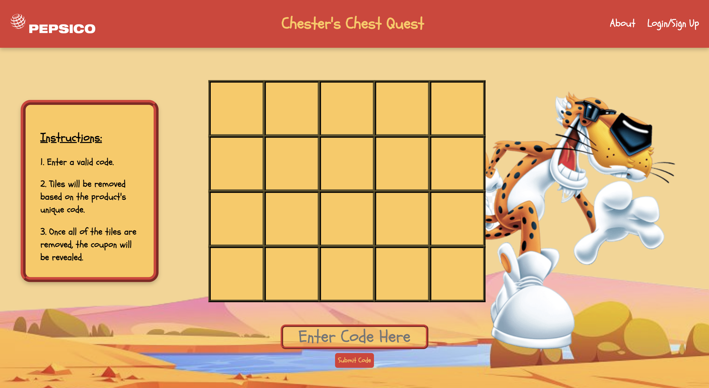

<h1>Inspiration</h1>  
Our inspiration was based on a few different ideas, the main being off of a YouTube video called "Curiosity: The App That Fooled Everyone". Another concept that we based our idea upon was local loyalty deals such as ‘after you buy 10 products, you get one for free. That is the main inspiration behind our entire concept. Instead of fully copying the format those examples use, we based our format on a quest, an adventure of sorts, allowing consumers to engage with the advertisement campaign on a more personal level as it provides an integration of a mini-game that uncovers savings.

<h1>What it does</h1>  
How our concept works is that frequent consumers are made aware of a little challenge that PepsiCo is engaging in. The challenge includes redemption codes to submit to our website, as you fill in each individual redemption code, which expires after one use, it unlocks grids off of our 5x4 grid table. As you unlock the entire grid, a QR code will be exposed, which will be a coupon code to use on the snacks.com website by PepsiCo. We decided that it would be a simpler process to integrate a discount code within the website whereas retailers across the nation would be difficult to reach, not just that, it would cost more due to retailer credit owed to stores who participate in the challenge.

Saving time, effort, and costs, this solution gives a simple process to redeem any coupon. Consumers will be able to and encouraged to participate as much as they want which leads to more sales of products. As consumers unlock multiple coupons, it gradually increases in value or it could possibly increase the rate at which the coupons are unlocked. We also offer a different portion size of our grid to be unlocked based upon the popularity of the product redemption code. For example, a less popular product unlocks 3 grids compared to 1 grid for a very popular product. This idea was taken to push less popular products, giving more incentive to push the least favorite sales, statistically pushing those products to a new demographic it has not reached till now. Reaching all new people, guaranteeing more of a chance of at least a few people coming back for more, at least more of a chance before the event.

In worries of production costs, it theoretically should not be affected too much. Processes of production will be altered obviously to embed the code inside the product so consumers cannot outplay the company to redeem codes without purchase. We intend the codes to be inside the products, For example:

For bottled drinks, underneath the cap
For jar products, underneath the cap
For chip bags, inside the bag itself and along the seals inside the bag.
There are definitely more ways to embed codes, but we do not want to affect production timing and costs too much.

<h1>How we built it</h1>  
Our tech stack consisted of: React.js for our front end, & Firebase Firestore as our backend.

The frontend consists of 3 parts: the navigation bar, the grid, and the text box.

Our first element on the navigation bar is the PepsiCo logo, which -when clicked, would lead to the official PepsiCo website.
In the center of our navigation bar, there is our official title for the site which is in the font “Schoolbell” which is from google fonts. On the right side of the bar, there is the About tab which leads to the “About PepsiCo” page
The Login/Signup tab when clicked uses Firebase Google Authentication feature to open another tab in which the user would log in to their google account to then present their grid onto the site itself.
The second part of the site is the grid, in which we created a grid of components called tiles that has 2 states: transparent and opaque. The default state is opaque because we originally want to hide the big coupon in the end but after a working code is entered and validated, a random tile would be turned into the second state of the grid where the tile is transparent, revealing some of the coupon in the back. Eventually, the whole coupon would be revealed with all of the tiles being transparent.
The third part of the site is the textbox and button to submit the code in which a code would be entered into the text box and once the button is clicked, an event that calls the validate function occurs. The validate function checks the code inputted with the list of available codes and validates whether or not the inputted code matches the list of available codes. Depending on the code inputted, tiles would be removed based on the sales of the product the code comes from.
For the backend functionality, we have 2 upper-level collections: users and productBrands.

Whenever a user signs in for the first time, their name, email, and a randomly generated user id is put into the collection as a document.
The users can sign in using the Firebase Authentication feature, which supports google authentication.
Then, for each user, a board collection is made for all of the boards that they have completed and the current board that they are working on.
Each board document contains information that encodes the user's progress in unlocking the coupon.
There were also many functions made to add and update the boards. The productBrands collection holds the information needed to validate the codes.
Each document in the productBrands has a unique ID that identifies the distinct sizes and flavors and it also has a weight that encodes how much of the board entering a code from that brand will reveal.
Additionally, each product brand has a collection called circulation, which contains all the valid codes that a user can enter to get rewarded. The code the user enters will simply be a combination of the brand id and the actual product id.
Challenges we ran into
A big challenge that we ran into was actually making our idea feasible. We had to think a lot about how we would embed codes into the various products that PepsiCo makes, and had to make many systems to ensure the integrity of the challenge. For example, there has to be a unique code for each product type and the individual product. This would make sure that the same person could not scan their code multiple times to obtain the coupon faster.

Additionally, we had a lot of challenges when regarding the layout of the web page, especially trying to align the various elements that make up the webpage. It was very difficult for us to orient each element specifically where we wanted them to be.

<h1>Accomplishments that we're proud of</h1>  
One thing that we are super proud of would be configuring the puzzle to go from opaque to transparent. We had a lot of issues figuring out how to make this interaction, however, once we finally got it to work by passing data to each individual tile, and changing the style properties based on the data, we were very proud of our work.

<h1>What we learned</h1>  
We learned a lot about react.js, especially how to make various interactive components that can be used in conjunction to make something complex. Making all of the squares for the board was something new to all of us, as we initialized the 4 by 5 grid of squares using a loop. Using react components in an array was something that we never did before.

We also learned a lot more about Firebase Firestore and document-based databases in general. For example, we used queries and timestamps to keep track of the most recently generated board. We also used the timestamps to generate new boards/coupons every week.

<h1>What's next for Chester's Chest Quest</h1>  
The end goal of this Quest would be longevity. Extending this limited-time quest to permanency would be a great concept to chase behind, instead of gradually increasing big prizes, it would be smaller prizes in the end, but it will keep consumers on their toes. As this concept increases in no time frame, it will expand to newer consumer bases and allow increased loyalty opportunities. Along with longevity, a plan to have a script that analyzes product sale patterns will be integrated within this same concept, the fewer sold products have a better clearing of the grid as mentioned earlier in how it works, but with this new integration, better prizes will only be won through purchasing of the fewer sold products. That is the vision we have for the future. Not only will this system reward consumers who have a favorite item they enjoy consuming, it will also give out rewards to customers for trying new products, therefore increasing sales.
